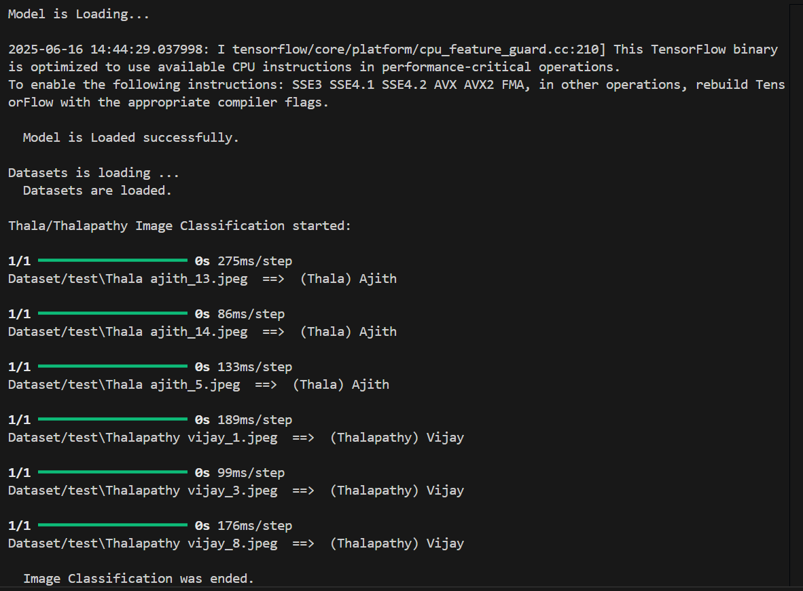
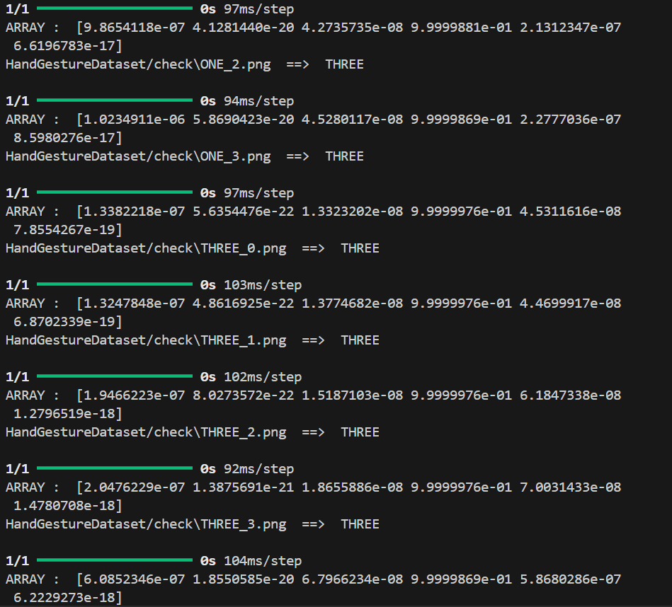
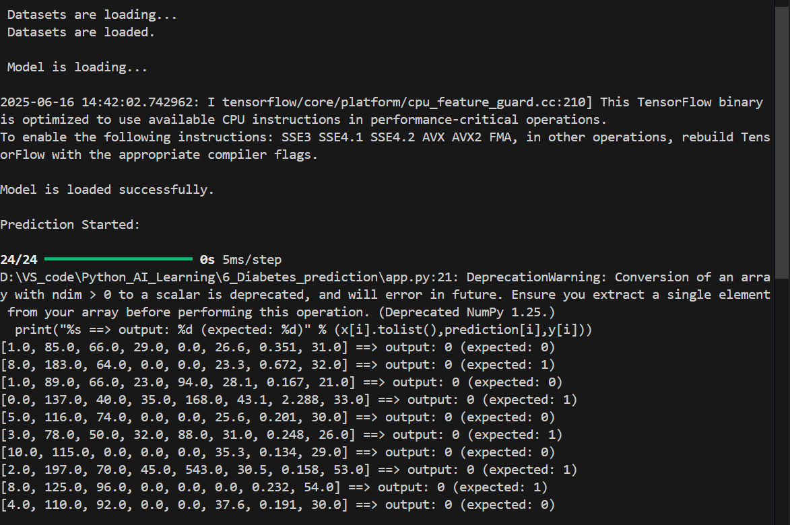

# 🤖 AI Learning – Hands-On Projects in Computer Vision & Face Recognition

A beginner-to-intermediate collection of practical **AI and computer vision** experiments using Python and OpenCV. This repository showcases real-time projects like **face detection**, **face recognition**, and **object tracking**—all built from scratch to learn core AI concepts.

## 🧠 What You'll Find
- ☘️ [**Leaf Disease Detection**](10_Leaf_Disease_Detection) using keras model and training with datasets<br>
<br>

- 🧍 [**Face Recognition**](4_Face_Recognition) using FisherFace algorithm <br>
<br>

- 😀 [**Emotion Recognition**](5_Emotion_Recognition) using FisherFace algorithm <br>
<br>
  
- 👁️‍🗨️ [**Face Detection**](1_FaceDetection) using Haar Cascades<br>
<br>

- 🧑 [**Image Classification**](8_Image_classification) using TensorFlow , keras<br>
<br>

- 🚗 [**Object Recognition**](7_Object_Recognition) using NetSSD pre-trained model<br>
<br>

- 🟥 [**Color Object Tracking**](3_ObjectDetection_color) using HSV color range and webcam<br>
<br>

- ✌ [**Hand Gesture Recognition**](9_Hand_Gesture_recognition) using HSV color range and webcam<br>
<br>

- 📱 [**Moving Object Detection**](2_Moving_Object_detection) using keras model and training<br>
<br>

- 📈 [**Diabetes Prediction**](6_Diabetes_prediction) using pre-trained model<br>
<br>

- 🎥 **Real-Time Video Processing** with OpenCV
- 🗂️ Custom dataset generation and preprocessing
- 📃 And more...

## 🛠️ Tech Stack
- **Python**
- **OpenCV**
- **NumPy**
- **Haarcascade Classifiers**
- **FisherFace Model**
- **TensorFlow**
- **Tourch**
- **keras**
- **TKinter**
- **And more....**

## 🚀 Getting Started
```bash
# Clone the repo
git clone https://github.com/mohanapriyan2006/Ai_Learning.git

# Install dependencies
pip install opencv-python numpy

# Run face detection
python 1_FaceDetection/face.py
